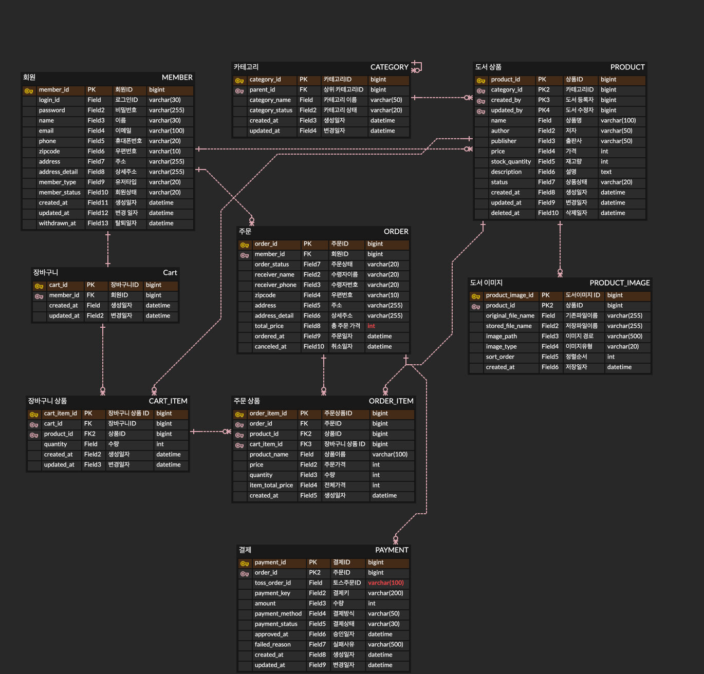

# 📚 JSP BookShop

> Spring Boot + JSP + MyBatis 기반의 서버 사이드 렌더링 도서 쇼핑몰 프로젝트

- JSP/JSTL 기반 화면과 Spring MVC 요청 흐름을 학습하기 위해 진행한 온라인 도서 쇼핑몰 프로젝트입니다.
- 회원가입, 로그인, 아이디/비밀번호 찾기, 상품 조회, 장바구니, 주문, 결제, 마이페이지, 관리자 상품/주문 관리 기능을 구현했습니다.
- 단순 CRUD를 넘어서 Session 기반 인증, 관리자 권한 분리, 상품 상태 관리, 주문/결제/재고 처리, 배송 상태 변경, Redis 기반 이메일 인증 흐름을 고려했습니다.
- 구현 과정에서 발생한 트러블슈팅과 설계 선택 이유를 `docs` 폴더에 별도로 정리했습니다.

---

# 🗓️ 개발 기간

- 2026.05.25 ~ 2026.07.07

---

# 1️⃣ ERD



회원, 상품, 장바구니, 주문, 결제 도메인을 기준으로 테이블을 분리했습니다.

주요 테이블 구성:

```text
member
category
product
product_image
cart
cart_item
orders
order_item
payment
```

---

# 🏛️ 프로젝트 구조

```text
src/main/java/hello/bookshop
├── admin
│   ├── controller
│   ├── dto
│   └── service
├── cart
│   ├── controller
│   ├── domain
│   ├── dto
│   ├── mapper
│   └── service
├── category
│   ├── domain
│   ├── mapper
│   ├── service
│   └── type
├── common
│   ├── advice
│   ├── config
│   ├── dto
│   ├── exception
│   ├── interceptor
│   └── session
├── file
├── home
│   ├── controller
│   ├── dto
│   └── service
├── member
│   ├── controller
│   ├── domain
│   ├── dto
│   ├── mapper
│   ├── service
│   ├── type
│   └── validator
├── order
│   ├── controller
│   ├── domain
│   ├── dto
│   ├── mapper
│   ├── service
│   └── type
├── payment
│   ├── client
│   ├── config
│   ├── controller
│   ├── domain
│   ├── dto
│   ├── mapper
│   ├── service
│   └── type
└── product
    ├── controller
    ├── domain
    ├── dto
    ├── mapper
    ├── service
    └── type

src/main/webapp/WEB-INF/views
├── admin
├── cart
├── common
├── member
├── order
├── payment
└── product
```

---

# 🛠 기술 스택

## 👨‍💻 Backend

- Java 17
- Spring Boot 3.5
- Spring MVC
- JSP / JSTL / EL
- MyBatis
- Bean Validation
- JavaMailSender
- Session / Interceptor 기반 인증 처리

## 🎨 Frontend

- HTML
- CSS
- JavaScript
- Bootstrap 5
- JSP / JSTL

## ⚙️ Database

- MySQL
- Redis
- MyBatis XML Mapper

## 💳 Payment

- Toss Payments Test API
- 결제 승인 API 연동
- 결제 성공/실패 상태 관리

## 🧪 Test

- JUnit 5
- AssertJ
- Mockito
- MyBatis Test
- 주문 재고 차감 동시성 테스트

## 🧰 Tools

- IntelliJ IDEA
- Git & GitHub
- Gradle
- DataGrip
- Notion

---

# 🧩 주요 기능

## 👤 회원 (Member)

### 회원가입

- [x] 회원가입 폼 구현
- [x] 아이디 중복 검사
- [x] 이메일 중복 검사
- [x] 비밀번호 암호화 저장
- [x] 입력값 검증 처리
- [x] 회원 기본 권한 `USER` 부여

### 로그인 / 로그아웃

- [x] 아이디 / 비밀번호 기반 로그인
- [x] 로그인 성공 시 Session 저장
- [x] 로그인 실패 처리
- [x] 로그아웃 시 Session 무효화
- [x] 비로그인 사용자 접근 제한

### 계정 찾기

- [x] 이름 / 이메일 / 휴대폰 번호 기반 아이디 찾기
- [x] 아이디 일부 마스킹 처리
- [x] 로그인 아이디 / 이메일 기반 비밀번호 찾기 1차 검증
- [x] Google SMTP 기반 인증번호 메일 발송
- [x] Redis TTL 기반 인증번호 저장
- [x] 인증번호 남은 시간 타이머 UI 표시
- [x] 인증 완료 후 비밀번호 재설정

### 마이페이지

- [x] 회원 정보 조회
- [x] 회원 정보 수정
- [x] 최근 주문 내역 조회
- [x] 장바구니/주문 요약 정보 표시

### 회원탈퇴

- [x] 비밀번호 확인 후 회원탈퇴 처리
- [x] `withdrawn_at` 기반 Soft Delete 적용
- [x] 탈퇴 회원 로그인 차단
- [x] 진행 중 주문 존재 시 탈퇴 제한
- [x] 탈퇴 시 장바구니 상품 정리
- [x] 탈퇴 완료 후 Session 무효화

---

# 🔐 인증 / 인가

- [x] `LoginCheckInterceptor` 구현
- [x] `AdminCheckInterceptor` 구현
- [x] `GuestOnlyInterceptor` 구현
- [x] 관리자 / 일반 사용자 권한 분리
- [x] 비로그인 사용자 접근 제한
- [x] 관리자 페이지 접근 권한 검증

---

# 📦 상품 (Product)

## 사용자 상품 기능

- [x] 상품 목록 조회
- [x] 상품 상세 조회
- [x] 카테고리별 상품 조회
- [x] 상품명 / 저자 검색
- [x] 검색 조건 유지
- [x] 페이징 처리
- [x] 판매 중 상품만 사용자 화면 노출

## 관리자 상품 기능

- [x] 상품 등록
- [x] 상품 수정
- [x] 상품 삭제
- [x] 상품 목록 조회
- [x] 상품 상세 조회
- [x] 카테고리 / 판매 상태 필터
- [x] 검색 및 페이징 처리
- [x] 대표 이미지 / 상세 이미지 업로드
- [x] 이미지 미리보기 처리

## 상품 상태 관리

- [x] `ACTIVE`
- [x] `SOLD_OUT`
- [x] `DELETED`

---

# 🛒 장바구니 (Cart)

- [x] 장바구니 담기
- [x] 기존 상품 담기 시 수량 증가
- [x] 장바구니 조회
- [x] 선택 상품 금액 계산
- [x] 전체 선택 / 개별 선택
- [x] 수량 변경
- [x] 장바구니 상품 삭제
- [x] 재고 초과 검증
- [x] Fetch 기반 비동기 수량 변경 / 삭제 처리

---

# 📄 주문 (Order)

- [x] 장바구니 선택 상품 주문 폼 생성
- [x] 배송지 입력
- [x] 주문 생성
- [x] 주문 상품 스냅샷 저장
- [x] 주문 내역 조회
- [x] 주문 상세 조회
- [x] 결제 실패 / 결제 대기 주문 사용자 주문내역 제외
- [x] 주문 생성 시 재고 검증
- [x] 결제 완료 시 재고 차감
- [x] 재고 차감 동시성 테스트

---

# 💳 결제 (Payment)

- [x] Toss Payments 결제창 연동
- [x] 결제 대기 상태 저장
- [x] 결제 승인 API 호출
- [x] 결제 금액 검증
- [x] 결제 성공 시 주문 상태 `PAID` 변경
- [x] 결제 실패 시 주문 상태 `FAILED` 변경
- [x] 결제 수단 관리

```text
CARD
TOSS_PAY
KAKAO_PAY
NAVER_PAY
PAYCO
EASY_PAY
UNKNOWN
```

---

# 🚚 배송 / 관리자 주문 관리

- [x] 사용자 주문배송 조회
- [x] 주문 상태별 배송 진행 상태 표시
- [x] 관리자 주문 목록 조회
- [x] 관리자 주문 목록 페이징 처리
- [x] 관리자 주문 상세 조회
- [x] 주문 상품 / 배송지 / 주문자 정보 확인
- [x] 배송 상태 변경
- [x] 주문 상태 전이 검증

```text
PAID → PREPARING → SHIPPING → DELIVERED
```

---

# 🔍 검색 기능

- [x] 상품명 검색
- [x] 저자 검색
- [x] 검색 결과 페이징 처리
- [x] 검색 조건 유지
- [x] 카테고리 필터와 검색 조건 동시 유지

---

# 🧪 테스트

주요 테스트 범위:

- [x] 회원가입 / 로그인 / 회원정보 수정 단위 테스트
- [x] 아이디 찾기 성공 / 실패 테스트
- [x] 비밀번호 찾기 인증번호 발송 / 검증 / 재설정 테스트
- [x] 상품 목록 / 상세 조회 테스트
- [x] 관리자 상품 등록 / 수정 / 삭제 테스트
- [x] 장바구니 담기 / 조회 / 수량 변경 / 삭제 테스트
- [x] 주문 생성 / 주문 내역 / 주문 상세 조회 테스트
- [x] 관리자 주문 조회 / 배송 상태 변경 테스트
- [x] 결제 승인 서비스 테스트
- [x] 회원탈퇴 성공 / 실패 테스트
- [x] 재고 차감 동시성 테스트

---

# 📄 문서화

구현 과정에서 발생한 주요 의사결정과 트러블슈팅을 `docs` 폴더에 정리했습니다.

```text
docs/decision
├── admin
├── cart
├── member
├── order
├── payment
└── product

docs/troubleshooting
├── admin
├── member
├── order
└── product
```

주요 문서:

- 상품 이미지 테이블 분리
- 관리자 상품 목록 필터/페이징 처리
- 장바구니 수량 변경 방식
- 주문 생성 시 스냅샷 데이터 저장
- 주문 재고 차감 동시성 처리
- Toss Payments 결제 흐름
- 관리자 주문/배송 상태 관리
- 회원탈퇴 Soft Delete 정책
- 아이디 찾기 및 비밀번호 재설정 인증 흐름
- Redis TTL 기반 인증번호 관리

---

# 🔥 핵심 구현 내용

## Session 기반 인증 처리

- 로그인 성공 시 Session에 사용자 정보를 저장했습니다.
- 인증이 필요한 URL은 `LoginCheckInterceptor`에서 접근을 제한했습니다.
- 관리자 URL은 `AdminCheckInterceptor`에서 관리자 권한을 검증했습니다.

## 상품 Soft Delete 및 상태 관리

- 상품 삭제 시 실제 데이터를 삭제하지 않고 상태를 `DELETED`로 변경했습니다.
- 사용자 화면에서는 `ACTIVE` 상태의 상품만 조회되도록 처리했습니다.
- 주문 결제 후 재고가 0이 되면 상품 상태를 `SOLD_OUT`으로 변경하도록 처리했습니다.

## 회원 Soft Delete 및 탈퇴 정책

- 회원탈퇴 시 회원 데이터를 물리 삭제하지 않고 `withdrawn_at`을 갱신했습니다.
- 로그인 및 회원 조회 기능에서는 `withdrawn_at IS NULL` 조건으로 탈퇴 회원을 제외했습니다.
- 결제 완료 후 배송 완료 전 주문이 존재하는 경우 회원탈퇴를 제한했습니다.
- 탈퇴 완료 시 주문/결제 이력은 보존하고 장바구니 상품은 삭제했습니다.

## 아이디 찾기 및 비밀번호 재설정

- 아이디 찾기는 이름, 이메일, 휴대폰 번호가 모두 일치하는 회원만 조회되도록 처리했습니다.
- 조회된 아이디는 전체 노출 대신 일부 마스킹하여 사용자에게 보여주도록 구현했습니다.
- 비밀번호 재설정은 로그인 아이디와 이메일을 먼저 검증한 뒤 인증번호를 발송하는 흐름으로 구성했습니다.
- 인증번호는 Redis에 TTL 기반으로 저장하고, JSP 화면에서는 남은 시간을 초 단위로 표시했습니다.
- 인증 완료 후에만 새 비밀번호로 변경할 수 있도록 Redis 인증 완료 키와 Session 값을 함께 검증했습니다.

## 주문 상품 스냅샷 저장

- 주문 이후 상품명이나 가격이 변경되어도 주문 당시 정보를 유지하기 위해 `order_item`에 상품명, 가격, 수량, 상품별 금액을 저장했습니다.

## 결제 승인 이후 재고 차감

- Toss Payments 결제 승인 이후 재고를 차감했습니다.
- 재고 차감은 조건부 UPDATE를 사용해 재고가 음수가 되지 않도록 처리했습니다.

```sql
UPDATE product
SET stock_quantity = stock_quantity - #{quantity}
WHERE product_id = #{productId}
AND stock_quantity >= #{quantity}
```

## 관리자 배송 상태 변경

- 관리자가 결제 완료된 주문의 배송 상태를 변경할 수 있도록 구현했습니다.
- 잘못된 상태 변경을 방지하기 위해 `OrderStatus`에서 상태 전이 가능 여부를 검증했습니다.

---

# ⚠️ 트러블슈팅

대표 트러블슈팅:

- JSP EL 표현식에서 DTO 필드명 불일치 문제
- 이미지 업로드 경로와 정적 리소스 조회 경로 불일치 문제
- 장바구니 수량 변경 후 화면 금액 동기화 문제
- 주문 재고 차감 동시성 테스트
- 결제 실패 주문이 사용자 주문 내역에 노출되던 문제
- 관리자/사용자 상품 예외 처리 redirect 경로 충돌 문제
- 공통 마이페이지 요약 정보를 JSP include에서 처리할 때의 한계
- 회원탈퇴 시 주문 이력 보존과 장바구니 정리 정책 선택
- 비밀번호 재설정 화면에서 Redis TTL과 JSP 타이머를 동기화하는 문제
- 인증 완료 전 비밀번호 재설정 URL 직접 접근을 차단하는 흐름 구성

자세한 내용은 `docs/troubleshooting` 및 `docs/decision` 폴더에 정리했습니다.

---

# 📚 회고

이번 프로젝트를 통해 JSP 기반 서버 사이드 렌더링 환경에서 Spring MVC, MyBatis, Session 인증, 관리자 기능, 계정 찾기, 주문/결제 흐름을 end-to-end로 구현했습니다.

특히 단순 CRUD를 넘어 장바구니 수량 변경, 주문 상품 스냅샷 저장, 결제 승인, 재고 차감, 배송 상태 변경, Redis 기반 비밀번호 재설정, 예외 처리 분리와 같은 쇼핑몰 도메인의 흐름을 직접 구현하며 전통적인 웹 애플리케이션 구조를 학습했습니다.

향후 개선할 부분:

- 결제 승인 후 재고 차감 실패 시 Toss 결제 취소 API를 통한 보상 처리
- 주문 취소 및 재고 복구 기능
- 배송 이력 테이블 분리
- 관리자 회원 관리 기능 고도화
- 탈퇴 회원 개인정보 보관 기간 정책 정리
- 인증번호 재발송 제한 및 인증 실패 횟수 제한
- 운영 환경 배포 및 CI/CD 구성
